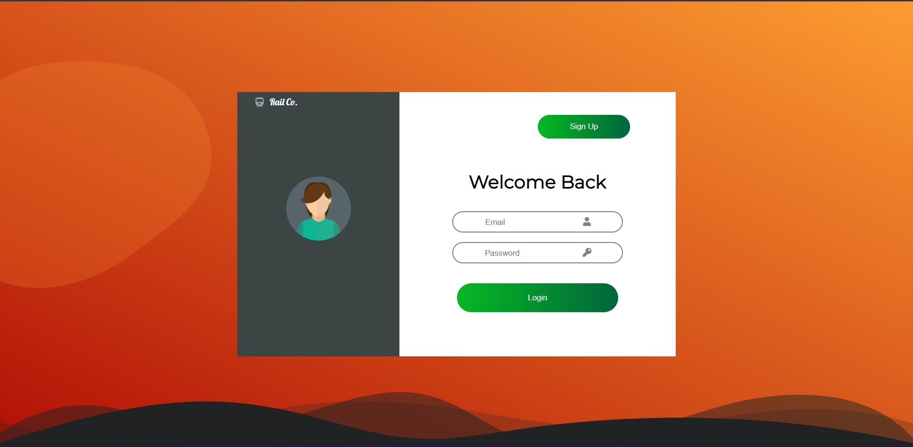

This the second version of railway project with django web framework of python.
It makes a major shift towards simple, modern and more realistic UI design.
Increasing the performance is the major goal here.
It is still a project under development.

